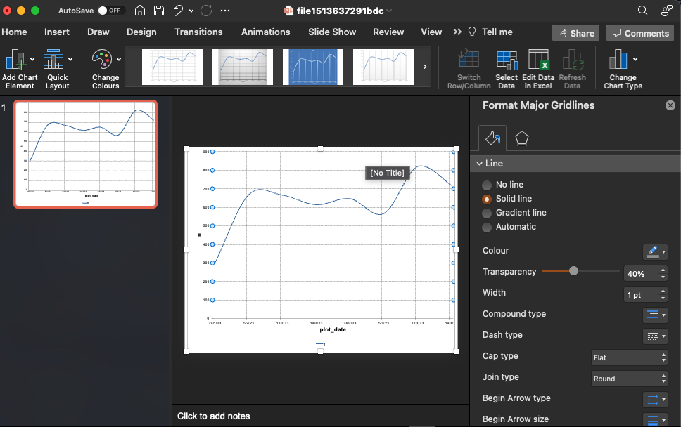

```{r, include = FALSE}
knitr::opts_chunk$set(
  collapse = TRUE,
  comment = "#>",
  warning = FALSE,
  fig.dim = c(7,3),
  fig.align = "center"
)
```

```{r setup, echo = FALSE, results='hide', message = FALSE}
library(DisplayR)
library(dplyr)
library(purrr)
library(officer)
library(mschart)
```

These charts are built on top of the mschart and officer packages, which form a portion of the 'officeverse': <https://ardata-fr.github.io/officeverse/index.html>

Our use of this package will mainly be for industrialising the process of exporting R charts to PowerPoint, such that the data is visible inside the presentation. This cuts down the burden on manual work and reduces the likelihood of error when working in Excel/PowerPoint.

Charts in initial automation:

-   Volume over time - line chart
-   Grouped volume over time - line chart
-   (Grouped) sentiment distribution - stacked horizontal bar chart

# Creating Volume Over Time Plots

Let's get some data.

```{r}
df <- DisplayR::disp_example

```
we'll use the `disp_ms_vot` function, which creates a line chart from a data frame. Type `?disp_ms_vot` to access the documentation.

The function counts our date variable for us, and buckets the date variable into day, week, month, quarter, or year, according to the input of the time argument.

```{r, eval = FALSE}
vot_plot <- df %>%
  disp_ms_vot(date = date, time = "week")
```

We can preview our plot in a temporary PowerPoint by printing it and setting preview = TRUE

```{r, eval = FALSE}
vot_plot %>%
  print(preview = TRUE)
```

{width="600" height="400"}

# Creating Grouped Volume Over Time Plots

Usually when creating Volume Over Time charts we want to create a chart which shows the volume for multiple groups, for example we may want to create a sentiment over time chart to show positive, negative and neutral, or the volume over time for each topic in a topic modelling output. Here we should use `disp_ms_vot_grouped`

```{r, eval = FALSE}
grouped_vot_plot <- df %>%
  disp_ms_vot_grouped(date = date, group_var = topic, time = "week")

grouped_vot_plot %>%
  print(preview = TRUE)
```

{width="600" height="400"}

Now we have a line for each topic, charting its weekly volume. However, the colours are the default colours and may not be what we want to output into PowerPoint.

## Restyling The Plot - Colours

To pass in custom colours we need a named list/vector of colours. We'll use the Viridis palette for demonstrative purposes:

```{r, eval = FALSE}
colours <- viridis::viridis_pal()(9)
topics <- sort(unique(df$topic))
names(colours) <- topics
print(colours)

grouped_vot_plot <- grouped_vot_plot %>%
  chart_data_stroke(values = colours) # use chart_data_stroke for line charts, chart_data_fill for bar charts.

grouped_vot_plot %>%
  print(preview = TRUE)
```

{width="600" height="400"}

Now each line has a colour on the viridis scale. We could have used a named vector/list with a different, custom palette - the principle remains the same, we take a named list of values and colours and feed them into the `chart_data_stroke` function. We can make sure the values are correct by extracting them from the data frame, as we did with topics by `topics <- sort(unique(df$topic))`

## Restyling The Plot - Titles

Another likely customisation you'll want to make is to programmatically add titles to your charts. You can use mschart's `chart_labels` function:

```{r, eval = FALSE}
grouped_vot_plot <- grouped_vot_plot %>%
  chart_labels(title = "Volume over time plot coloured in Viridis scale", xlab = "Date", ylab = "Weekly volume")
```

# Visualising Sentiment Distributions

We often need to visualise sentiment distributions - either for entire datasets or for groups, or groups within groups...

Generally we prefer stacked bar charts to pie charts and their variants. The human visual system is better at comparing lengths and heights than it is areas. They're also neater, and more concise.

## Creating Stacked Sentiment Barcharts %

To create our stacked sentiment barcharts we can use the disp_ms_sent_grouped function. This function expects you to enter the variable which contains sentiment categories - it will remove any NAs for sentiment, and make the sentiment categories lower case.

You also need to input a topic variable, and you can decide whether the output is 'percent' or 'volume' with the `plot_type` argument. 

<div class="tip">
**Tip**: Using 'percent' will ensure that each stacked bar is the same length, but may be misleading when volume is low. 
</div>

```{r, eval = FALSE}
library(ggplot2)
grouped_sent_chart <- df %>%
  disp_ms_sent_grouped(sentiment, topic, plot_type = "percent") %>%
  # chart_data_labels(show_val = TRUE)  %>%
  chart_theme(
    grid_major_line_x = fp_border(style = "none"),
    grid_major_line_y = fp_border(style = "none"),
    axis_ticks_y = fp_border(style = "none")
  )

grouped_sent_chart %>% print(preview = TRUE)
```

### Restyling The Plot - Ordering + Removing Grid Lines

The ordering of our plot is currently alphabetical, which may not be the best way - indeed often is not the best way. A more reasonable ordering may be overall volume. As we have a topic_n variable, we can reorder the topic by topic_n, using `mutate` and `reorder`:

```{r, eval = FALSE}
grouped_sent_chart <- df %>%
  mutate(topic = reorder(topic, topic_n)) %>%
  disp_ms_sent_grouped(sentiment, topic, plot_type = "percent") %>%
  # chart_data_labels(show_val = TRUE)  %>%
  chart_theme(
    grid_major_line_x = fp_border(style = "none"),
    grid_major_line_y = fp_border(style = "none"),
    axis_ticks_y = fp_border(style = "none")
  )
grouped_sent_chart %>%
  print(preview = TRUE)
```

Notice that we removed many of the grid lines, this has not been included as defaults within the charting functions presently.

## Creating Stacked Sentiment Barcharts - Volume

Sometimes we may need to create raw volume rather than proportion/%-based charts, we can use the plot_type = "volume" argument to achieve this.

```{r, eval = FALSE}
grouped_sent_chart <- df %>%
  mutate(topic = reorder(topic, topic_n)) %>%
  disp_ms_sent_grouped(sentiment, topic, plot_type = "volume")
```

### Restyling The Plot - Removing Data Labels

However, we notice that the data labels are now not feasible - some categories have bars which are too small to fit the labels. In this case we can remove with:

```{r, eval = FALSE}
grouped_sent_chart %>%
  chart_data_labels(show_val = FALSE) %>%
  print(preview = TRUE)
```

# Exporting to PowerPoint - Existing Presentation

So you've made your plots and now you need to export them efficiently to PowerPoint, this is where the {officer} package shines.

The options for exporting are:

1.  Read a current PowerPoint presentation and insert the chart into a new slide.

2.  Create a new PowerPoint presentation, insert a new slide, copy the chart into an existing presentation.

`1.` is nearly always preferable over `2.` as for each plot it cuts down on overall steps to go from R --\> PowerPoint, and when dealing with 10s, or 100s of plots, the difference is meaningful.

However, you need to know the path to your PowerPoint presentation, this can be non-trivial for users not familiar with navigating file systems and directories, especially when working on an interactive/live document, meaning you may need to opt for 2.

## One plot at a time

First we need to initialise a PowerPoint presentation. I have a demo presentation stored at a specific file path, we'll use that one for now. We can store the filepath in a variable and re-use that variable.

```{r, eval = FALSE}
presentation_path <- "~/Documents/presentations/officer_demo.pptx"

presentation <- read_pptx(presentation_path)
```

::: tip
**Tip**: for Mac users, use Finder to identify the root to your presentation - right click PowerPoint's tray icon -\> options -\> open in Finder
:::

Before we begin, we can use the `pptx_summary` function to output a dataframe showing the current contents of your PowerPoint and the `layout_summary` function to output a dataframe containing the available slide templates in your PowerPoint.

<div class="tip">
**Tip**: Reading in a PowerPoint presentation with custom 'Master Slides' will give you more slide templates to work with.
</div>

```{r, eval = FALSE}
pptx_summary(presentation)
layout_summary(presentation)
```

There is a utility function which ships with DisplayR `disp_add_slide` which takes a presentation and a chart as its main inputs, as well as a layout type and master.

To add the slide with a 'Two Content' layout, we can use the disp_add_slide function. This is a common layout wherein the chart sits on the right and the copy on the left. We can choose any layout that was output from the `layout_summary` function. We then print our presentation to our presentation path to save the changes.

```{r, eval = FALSE}
presentation <- disp_add_slide(presentation, grouped_sent_chart, layout = "Two Content")

print(presentation, target = presentation_path)
```

## Multiple plots

Let's say we had a list of plots, we'll go with volume over time for now. We could generate a list of plots, one for each topic using the following code:

```{r, eval = FALSE}
topic_names <- unique(sort(df$topic))
plot_list <- df %>%
  group_split(topic) %>%
  map(~ .x %>%
    disp_ms_vot(date = date, time = "week") %>%
    chart_theme(legend_position = "n")) %>%
  setNames(topic_names) %>% # set the name of the list just in case
  map2(.x = ., .y = topic_names, ~ .x %>%
    chart_labels(title = paste0("Volume over time - ", .y))) # add a title to each plot

presentation <- purrr::reduce(plot_list, disp_add_slide, layout = "Two Content", .init = presentation)

print(presentation, presentation_path)
```

We added some additional logic to add a title to each plot so that we can keep track of it inside PowerPoint. Now we can go to the file's destination and open it, we should see our new slides.

<div class="warning">
**Warning**: A good understanding of iteration using the {purrr} package is important if veering away from the script.
</div>

# Exporting to PowerPoint - New Presentation

In cases where you're working on live presentations or big presentations, you may need to render your slides to a new presentation and then copy them over. The data will copy over with the chart.


To do this, leave the 'path =' argument blank in the `read_pptx` function
```{r, eval = FALSE}
presentation <- read_pptx()

grouped_sent_chart <- df %>%
  mutate(topic = reorder(topic, topic_n)) %>%
  disp_ms_sent_grouped(sentiment, topic, plot_type = "percent")


presentation <- disp_add_slide(presentation, grouped_sent_chart, layout = "Two Content")

print(presentation, target = "~/Documents/tmp_ppt_pres.pptx")
```

You can now open the presentation again and copy charts across.

## Creating a gradient-filled volume + sentiment chart

```{r}
(my_ft <- df %>%
  disp_flextable(topic, sentiment))
```

We can preview how this would look in powerpoint with:

```{r}
print(my_ft, preview = "pptx")
```

And we can export similarly to how we exported the charts.

<div class="tip">
**Tip**: When in PowerPoint you can remove the gradient fill in the total row on the Positive + Negative columns via 'format shape'
</div>


That's it for now, see the {officer} and {mschart} packages for further tips on styling and exporting plots.
